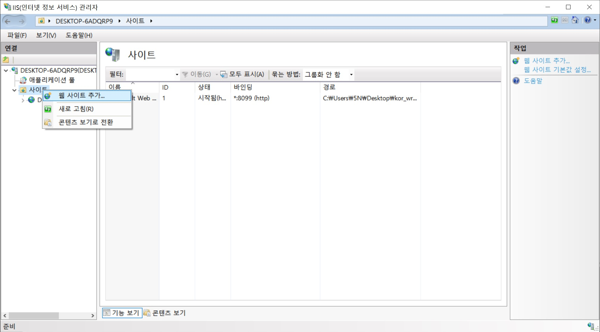

# IIS 설치 및 설정

### 1.IIS 설치
   제어판 → 프로그램 제거 또는 변경 → Windows 기능 켜기/끄기  
    
   <!-- {: width="100" height="100"} -->
   
   

 

인터넷 정보 서비스 → World Wide Web 서비스 → 응용 프로그램 개발 기능  
인터넷 정보 서비스 → 웹 관리 도구  
다음과 같이 설정한다.

---

### 2. IIS 관리자 설정

    2-1. 웹사이트 추가

사이트 이름 : wrestling
실제 경로 : C:\Users\5N\Desktop\wrestling

    2-2. 사이트 바인딩 편집
    기존 포트인 80에서 변경하는 이유 : 포트 충돌 우려가 있어서 변경하는 것을 추천

    2-3. 고급 설정
    실제 경로로 지정한 곳이 해당 웹 루트 디렉토리가 된다.

실제 경로 : C:\Users\5N\Desktop\wrestling

     2-4. 기본 설정
    고급 설정에서 수정하면 자동 반영된다.

애플리케이션 풀 : Classic .NET AppPool  
실제 경로 : C:\Users\5N\Desktop\wrestling

    2-5. 가상 디렉터리

별칭 : wrestling  
실제 경로 : C:\Users\5N\Desktop\wrestling

    2-6. ASP 설정

---

### 기타 설정

C:\Users\5N\Desktop\wrestling\default.asp
